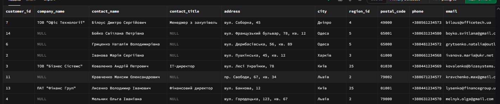
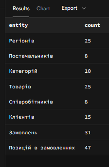
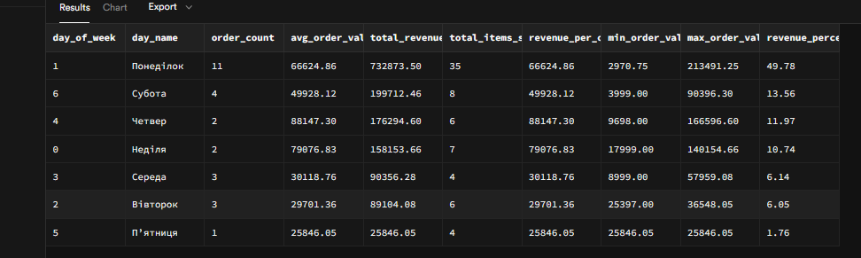

# Лабораторна робота 1. Робота з СУБД PostgreSQL та основи SQL

## Загальна інформація

**Здобувач освіти:** [Анікєєнко Микола Олександрович]
**Група:** [ІПЗ-32]
**Обраний рівень складності:** [3]

## Виконання завдань
## Рівень 1
### Список таблиць

```sql
-- Запит для отримання списку таблиць
SELECT table_name
FROM information_schema.tables
WHERE table_schema = 'public'
ORDER BY table_name;
```
Результат: У базі даних створено 8 основних таблиць: categories, customers, employees, order_items, orders, products, regions, suppliers.
Скріншот 

### Отримати всі записи з таблиці customers.
```sql
SELECT * FROM customers;
```
Результат: Отримано 15 записів клієнтів, включаючи як фізичних осіб, так і юридичні особи з різних міст України.
Скріншот 

### Вивести тільки назви товарів і їхні ціни з таблиці products.
```sql
SELECT product_name, unit_price FROM products;
```
Результат:
Скріншот 

### Показати контактні дані всіх співробітників (ім'я, прізвище, телефон, email).
```sql
SELECT first_name, last_name, phone, email FROM employees
```
Результат:
Скріншот 

### Знайти всіх клієнтів з міста Київ.
```sql
SELECT * FROM customers WHERE city = 'Київ';
```
Результат:
Скріншот 

### Вивести товари, які коштують більше 25000 грн.
```sql
SELECT * FROM products WHERE unit_price > 20000;
```
Результат:
Скріншот 

### Показати всі замовлення зі статусом 'delivered'
```sql
SELECT * FROM orders WHERE order_status = 'delivered';
```
Результат:
Скріншот


### Знайти співробітників, які працюють у відділі продажів (посада містить слово "продаж").
```sql
SELECT * FROM employee_performance WHERE title LIKE '%продаж%';
```
Результат:
Скріншот


### Відсортувати товари за зростанням ціни.
```sql
SELECT * FROM products ORDER BY unit_price ASC;
```
Результат:
Скріншот


### Показати клієнтів в алфавітному порядку за іменем контактної особи.
```sql
SELECT * FROM customers ORDER BY contact_name ASC;
```
Результат:
Скріншот


### Вивести замовлення від найновіших до найстаріших.
```sql
SELECT * FROM orders ORDER BY order_date DESC;
```
Результат:
Скріншот


### Показати перші 10 найдорожчих товарів.
```sql
SELECT * FROM products ORDER BY unit_price DESC LIMIT 10;
```
Результат:
Скріншот


### Вивести 5 останніх замовлень (за датою).
```sql
SELECT * FROM orders ORDER BY order_date DESC LIMIT 5;
```
Результат:
Скріншот 

### Отримати перших 8 клієнтів в алфавітному порядку.
```sql
SELECT * FROM customers ORDER BY contact_name ASC LIMIT 8;
```
Результат:
Скріншот

Рівень 2

### Знайти всіх клієнтів, чиї імена починаються на "Іван".
```sql
SELECT * FROM customers WHERE contact_name LIKE 'Іван%';
```
Результат:
Скріншот


### Вивести товари, в назві яких є слово "phone" або "телефон".
```sql
SELECT * FROM products 
WHERE product_name ILIKE '%phone%' OR product_name ILIKE '%телефон%';
```
Результат:
Скріншот

## Самостійно: Придумати та виконати 3 власні запити з використанням LIKE для пошуку за різними зразками (початок, кінець, містить). Логічні оператори AND, OR, NOT:
    
### пошук свіх ТОВ
```sql
SELECT * FROM customers 
WHERE company_name LIKE 'ТОВ%';
```
Результат:
Скріншот


### Пошук всіх замовлень укр та нова пошта
```sql
SELECT * FROM orders 
WHERE ship_via LIKE 'Нова Пошта' OR ship_via LIKE 'УкрПошта';
```
Результат:
Скріншот


### пошук товарів PRO та MAX
```sql
SELECT * FROM products 
WHERE product_name LIKE '%Pro%' OR product_name LIKE '%Max%';
```
Результат:
Скріншот


### Знайти товари дорожчі за 15000 грн і дешевші за 50000 грн.
```sql
SELECT * FROM products 
WHERE unit_price > 15000 AND unit_price < 50000;
```
Результат:
Скріншот


### Вивести клієнтів з Києва або Львова, які є юридичними особами.
```sql
SELECT * FROM customers 
WHERE (city = 'Київ' OR city = 'Львів') 
  AND customer_type = 'company';
```
Результат:
Скріншот


### IN + BETWEEN: Знайти замовлення з певних міст у середньому ціновому діапазоні
```sql
SELECT * FROM customers, orders
WHERE city IN ('Київ', 'Львів', 'Одеса') 
  AND freight BETWEEN 400 AND 1000
  AND order_date >= '2024-01-01'
ORDER BY freight DESC;
```
Результат:
Скріншот

## Самостійно: Створити 4 власні запити з комбінаціями логічних операторів для різних таблиць. Оператори IN, BETWEEN, IS NULL:
    
### IS NOT NULL + BETWEEN: Знайти клієнтів з повною контактною інформацією та певним діапазоном зареєстрованих
```sql
SELECT * FROM customers 
WHERE phone IS NOT NULL 
  AND email IS NOT NULL
  AND registration_date BETWEEN '2023-01-01' AND '2024-12-31'
ORDER BY registration_date DESC;
```
Результат:
Скріншот


### Знайти клієнтів в яких є тільки email
```sql
SELECT * FROM customers 
WHERE email IS NULL
  AND registration_date BETWEEN '2023-01-01' AND '2024-12-31'
ORDER BY registration_date DESC;
```
Результат:
Скріншот


### Знайти товари певних категорій без опису
```sql
SELECT * FROM products
WHERE category_id IN (1, 2, 3) AND description IS NULL;
```
Результат:
Скріншот


### Вивести клієнтів з міст Київ, Харків, Одеса, Дніпро.
```sql
SELECT * FROM customers 
WHERE city IN ('Київ', 'Харків', 'Одеса', 'Дніпро');
```
Результат:
Скріншот


### Знайти товари в ціновому діапазоні від 10000 до 30000 грн.
```sql
SELECT * FROM products 
WHERE unit_price BETWEEN 10000 AND 30000;
```
Результат:
Скріншот

## Самостійно: Придумати та виконати по 2 запити для кожного оператора (IN, BETWEEN, IS NULL/IS NOT NULL).

### пошук по київу
```sql
SELECT * FROM employees
WHERE city IN ('Київ');
```
Результат:
Скріншот


### пошук замовлень
```sql
SELECT * FROM orders
WHERE order_status IN ('pending');
```
Результат:
Скріншот


### пошук по зарплаті
```sql
SELECT * FROM employees
WHERE salary BETWEEN 20000 AND 25000;
```
Результат:
Скріншот


### Пошук заказов по дати
```sql
SELECT * FROM orders
WHERE order_date BETWEEN '2024-01-01' AND '2024-03-31';
```
Результат:
Скріншот


### пошук по reports_to  IS NULL
```sql
SELECT * FROM employees
WHERE reports_to IS NULL;
```
Результат:
Скріншот


### пошук по reports_to IS NOT NULL
```sql
SELECT * FROM employees
WHERE reports_to IS NOT NULL;
```
Результат:
Скріншот

## Самостійно: Створити 5 складних запитів, які поєднують різні типи умов (LIKE + AND/OR, BETWEEN + IN, тощо).

### Знайти співробітників, у яких ім'я починається на 'Н' або прізвище закінчується на 'вна', і які отримують зарплату від 20000 до 40000, і працюють у регіонах 3 або 5
```sql
SELECT * FROM employees
WHERE (first_name LIKE 'Н%' OR last_name LIKE '%вна')
  AND salary BETWEEN 20000 AND 40000
  AND region_id IN (3, 5);
```
Результат:
Скріншот


### Знайти товари, у яких є залишок на складі (не NULL), назва містить 'Pro' або 'MAX' ціна більше 500, і вони належать до категорій 1, 3 або 5
```sql
SELECT * FROM products
WHERE units_in_stock IS NOT NULL
  AND (product_name LIKE '%Pro%' OR product_name LIKE '%MAX%')
  AND unit_price > 500
  AND category_id IN (1, 3, 5);
```
Результат:
Скріншот


### Знайти співробітників, прийнятих на роботу в 2023 році, які працюють у відділах 2, 4, 6 або 8, і мають зарплату менше 3000 або більше 7000
```sql
SELECT * FROM employees
WHERE hire_date BETWEEN '2023-01-01' AND '2023-12-31'
  AND (salary < 3000 OR salary > 7000);
```
Результат:
Скріншот


### Знайти замовлення за 2024 року від клієнтів з Kиїва, де статус не 'delivered' і сума більше 100
```sql
SELECT * FROM orders
WHERE order_date BETWEEN '2024-01-01' AND '2024-12-31'
  AND customer_id IN (
    SELECT customer_id 
    FROM customers 
    WHERE ship_city IN ('Київ')
  )
  AND order_status NOT LIKE 'delivered'
  AND freight > 100;
```
Результат:
Скріншот


### Знайти клієнтів з компаніями, назви яких містять 'Технології' або 'Медіа', які знаходяться в Київи або Дніпрі
```sql
SELECT * FROM customers
WHERE (company_name LIKE '%Технології%' OR company_name LIKE '%Медіа%')
  AND city IN ('Дніпро', 'Київ')
```
Результат:
Скріншот

## Самостійно: Написати 3 запити з сортуванням за кількома полями та 2 запити з використанням OFFSET для пагінації.

### Сортування співробітників
```sql
SELECT * FROM employees
ORDER BY 
    title ASC,
    salary DESC,
    hire_date ASC;
```
Результат:
Скріншот


### Сортування товарів
```sql
SELECT * FROM products
ORDER BY 
    category_id ASC,
    unit_price ASC,
    units_in_stock DESC;
```
Результат:
Скріншот


### Сортування замовлень
```sql
SELECT * FROM orders
ORDER BY 
    order_date DESC,
    freight DESC,
    customer_id ASC;
```
Результат:
Скріншот


### Пагінація користувачів
```sql
SELECT * FROM customers
ORDER BY registration_date DESC
LIMIT 5 OFFSET 10;
```
Результат:
Скріншот


### Пагінація
```sql
SELECT * FROM products 
WHERE discontinued = false 
ORDER BY 
    unit_price ASC,
    reorder_level DESC,
    product_name ASC
LIMIT 20 OFFSET 0;
```
Результат:
Скріншот

## Рівень 3

### Знайти товари, в назві яких є "Samsung" або "Apple", але немає слова "чохол".
```sql
SELECT * FROM products 
WHERE (product_name LIKE '%Samsung%' OR product_name LIKE '%Apple%') 
  AND product_name NOT LIKE '%чохол%';
```
Результат:
Скріншот

## Створити 4 власні складні запити з комбінаціями LIKE та логічних операторів.

### Пошук клієнтів з певними доменами email та замовленнями за період
```sql
SELECT 
    c.customer_id,
    c.contact_name,
    c.email,
    c.customer_type,
    COUNT(o.order_id) as order_count,
    SUM(oi.unit_price * oi.quantity * (1 - oi.discount)) as total_spent
FROM customers c
JOIN orders o ON c.customer_id = o.customer_id
JOIN order_items oi ON o.order_id = oi.order_id
WHERE 
    -- Пошук за доменами email
    (c.email LIKE '%@gmail.com' OR c.email LIKE '%@ukr.net')
    -- Фільтрація за типом клієнта та датою
    AND c.customer_type = 'individual'
    AND o.order_date BETWEEN '2024-01-01' AND '2024-06-30'
    -- Виключення скасованих замовлень
    AND o.order_status != 'cancelled'
GROUP BY c.customer_id, c.contact_name, c.email, c.customer_type
HAVING COUNT(o.order_id) >= 2
ORDER BY total_spent DESC;
```
Результат:
Скріншот


### Аналіз товарів брендів Apple та Samsung з низькими запасами
```sql
SELECT 
    p.product_id,
    p.product_name,
    p.unit_price,
    p.units_in_stock,
    p.units_on_order,
    c.category_name,
    s.company_name as supplier,
    -- Розрахунок статусу запасу
    CASE 
        WHEN p.units_in_stock <= p.reorder_level THEN 'CRITICAL'
        WHEN p.units_in_stock <= p.reorder_level * 2 THEN 'LOW'
        ELSE 'NORMAL'
    END as stock_status
FROM products p
JOIN categories c ON p.category_id = c.category_id
JOIN suppliers s ON p.supplier_id = s.supplier_id
WHERE 
    -- Пошук продуктів Apple та Samsung
    (p.product_name LIKE '%iPhone%' 
     OR p.product_name LIKE '%MacBook%' 
     OR p.product_name LIKE '%iPad%'
     OR p.product_name LIKE '%Samsung%'
     OR p.product_name LIKE '%Galaxy%')
    -- Фільтрація за ціною та запасами
    AND p.unit_price > 15000
    AND p.discontinued = false
    AND (p.units_in_stock < 10 OR p.units_on_order > 0)
    -- Виключення аксесуарів
    AND c.category_name NOT LIKE '%Аксесуари%'
ORDER BY 
    stock_status DESC,
    p.units_in_stock ASC,
    p.unit_price DESC;
```
Результат:
Скріншот


### Пошук співробітників з продажами у конкретних регіонах та товарних категоріях
```sql
SELECT 
    e.employee_id,
    e.first_name || ' ' || e.last_name as employee_name,
    e.title,
    r.region_name,
    COUNT(DISTINCT o.order_id) as total_orders,
    COUNT(DISTINCT o.customer_id) as unique_customers,
    SUM(oi.quantity) as total_items_sold,
    ROUND(SUM(oi.unit_price * oi.quantity * (1 - oi.discount)), 2) as total_revenue,
    -- Визначення спеціалізації співробітника
    STRING_AGG(DISTINCT cat.category_name, ', ') as categories_handled
FROM employees e
JOIN orders o ON e.employee_id = o.employee_id
JOIN order_items oi ON o.order_id = oi.order_id
JOIN products p ON oi.product_id = p.product_id
JOIN categories cat ON p.category_id = cat.category_id
JOIN regions r ON e.region_id = r.region_id
WHERE 
    -- Фільтрація за регіонами співробітників
    (r.region_name LIKE '%Київ%' OR r.region_name LIKE '%Львів%')
    -- Фільтрація за категоріями товарів
    AND (cat.category_name LIKE '%Смартфон%' 
         OR cat.category_name LIKE '%Ноутбук%'
         OR cat.category_name LIKE '%Планшет%')
    -- Період аналізу
    AND o.order_date BETWEEN '2024-01-01' AND '2024-12-31'
    -- Тільки успішні замовлення
    AND o.order_status IN ('delivered', 'shipped')
    -- Співробітники не на керівних посадах
    AND e.title NOT LIKE '%Директор%'
    AND e.title NOT LIKE '%Головний%'
GROUP BY e.employee_id, e.first_name, e.last_name, e.title, r.region_name
HAVING 
    COUNT(DISTINCT o.order_id) >= 3
    AND SUM(oi.unit_price * oi.quantity * (1 - oi.discount)) > 50000
ORDER BY total_revenue DESC, total_orders DESC;
```
Результат:
Скріншот


### Комплексний аналіз постачальників та їх продуктів з динамікою продажів
```sql
SELECT 
    s.supplier_id,
    s.company_name,
    s.contact_name,
    r.region_name as supplier_region,
    COUNT(p.product_id) as total_products,
    SUM(CASE WHEN p.discontinued = false THEN 1 ELSE 0 END) as active_products,
    COUNT(oi.order_item_id) as total_sales,
    SUM(oi.quantity) as total_units_sold,
    ROUND(SUM(oi.unit_price * oi.quantity * (1 - oi.discount)), 2) as total_revenue,
    -- Спрощений підхід для топ категорій
    (SELECT STRING_AGG(cat.category_name, ', ') 
     FROM categories cat
     WHERE cat.category_id IN (
         SELECT p2.category_id
         FROM products p2
         JOIN order_items oi2 ON p2.product_id = oi2.product_id
         WHERE p2.supplier_id = s.supplier_id
         GROUP BY p2.category_id
         ORDER BY SUM(oi2.quantity) DESC
         LIMIT 3
     )
    ) as top_categories,
    ROUND(AVG(p.unit_price), 2) as avg_product_price
FROM suppliers s
JOIN regions r ON s.region_id = r.region_id
JOIN products p ON s.supplier_id = p.supplier_id
LEFT JOIN order_items oi ON p.product_id = oi.product_id
LEFT JOIN orders o ON oi.order_id = o.order_id
WHERE 
    (s.company_name LIKE '%ТОВ%' OR s.company_name LIKE '%ПП%')
    AND (r.region_name LIKE '%Київ%' OR r.region_name LIKE '%Львів%' OR r.region_name LIKE '%Харків%')
    AND p.unit_price BETWEEN 5000 AND 100000
    AND p.discontinued = false
    AND p.units_in_stock > 0
    AND (o.order_date IS NULL OR o.order_date BETWEEN '2024-01-01' AND '2024-12-31')
    AND (o.order_status IS NULL OR o.order_status IN ('delivered', 'shipped'))
GROUP BY s.supplier_id, s.company_name, s.contact_name, r.region_name
HAVING COUNT(p.product_id) >= 3
ORDER BY total_revenue DESC NULLS LAST;
```
Результат:
Скріншот


### Знайти товари дорожчі 20000 грн (категорії 1 або 2) АБО товари дешевші 5000 грн будь-якої категорії.
```sql
SELECT * FROM products 
WHERE (unit_price > 20000 AND category_id IN (1, 2)) 
   OR unit_price < 5000;
```
Результат:
Скріншот

## Самостійно: Написати 3 запити з складними вкладеними умовами, використовуючи дужки для групування логіки.

### Аналіз клієнтів з комплексними критеріями
```sql
SELECT 
    c.customer_id,
    c.contact_name,
    c.email,
    c.customer_type,
    c.city,
    r.region_name,
    COUNT(o.order_id) as total_orders,
    SUM(oi.unit_price * oi.quantity * (1 - oi.discount)) as total_spent,
    AVG(oi.unit_price * oi.quantity * (1 - oi.discount)) as avg_order_value
FROM customers c
JOIN regions r ON c.region_id = r.region_id
LEFT JOIN orders o ON c.customer_id = o.customer_id
LEFT JOIN order_items oi ON o.order_id = oi.order_id
WHERE 
    -- Комплексна умова для пошуку "цінних" клієнтів
    (
        -- Умова 1: Компанії з певних регіонів
        (
            c.customer_type = 'company' 
            AND r.region_name IN ('Київська область', 'Львівська область', 'Харківська область')
        )
        OR 
        -- Умова 2: Фізичні особи з певних регіонів та email
        (
            c.customer_type = 'individual' 
            AND (
                (r.region_name LIKE '%Київ%' AND c.email LIKE '%@gmail.com')
                OR 
                (r.region_name IN ('Львівська область', 'Харківська область') AND c.email LIKE '%@ukr.net')
            )
        )
    )
    -- Додаткові фільтри для всіх клієнтів
    AND (
        c.email LIKE '%@gmail.com' 
        OR c.email LIKE '%@ukr.net'
        OR (c.email LIKE '%@%.ua' AND c.customer_type = 'company')
    )
    AND (o.order_status IS NULL OR o.order_status IN ('delivered', 'shipped'))
    AND (o.order_date IS NULL OR o.order_date BETWEEN '2024-01-01' AND '2024-12-31')
GROUP BY c.customer_id, c.contact_name, c.email, c.customer_type, c.city, r.region_name
HAVING 
    -- Фінальна перевірка після групування (використовуємо оригінальні вирази, не аліаси)
    (
        (c.customer_type = 'company' AND SUM(oi.unit_price * oi.quantity * (1 - oi.discount)) > 100000 AND COUNT(o.order_id) >= 3)
        OR 
        (c.customer_type = 'individual' AND SUM(oi.unit_price * oi.quantity * (1 - oi.discount)) > 50000 AND COUNT(o.order_id) >= 2)
    )
    AND (AVG(oi.unit_price * oi.quantity * (1 - oi.discount)) > 10000 OR COUNT(o.order_id) = 0)
ORDER BY SUM(oi.unit_price * oi.quantity * (1 - oi.discount)) DESC NULLS LAST, COUNT(o.order_id) DESC;
```
Результат:
Скріншот


### Аналіз товарів з багаторівневими умовами
```sql
SELECT 
    p.product_id,
    p.product_name,
    p.unit_price,
    p.units_in_stock,
    p.units_on_order,
    c.category_name,
    s.company_name as supplier_name,
    r.region_name as supplier_region,
    COUNT(oi.order_item_id) as times_ordered,
    SUM(oi.quantity) as total_units_sold,
    -- Категорізація товарів за складними критеріями
    CASE 
        WHEN (
            -- Преміум товари
            (p.unit_price > 30000 AND c.category_name IN ('Смартфони та телефони', 'Ноутбуки та комп''ютери'))
            OR 
            (p.unit_price > 50000 AND c.category_name IN ('Телевізори та аудіо'))
            OR
            (p.product_name LIKE '%iPhone%' OR p.product_name LIKE '%MacBook%')
        ) THEN 'PREMIUM'
        WHEN (
            -- Товари середнього класу
            (p.unit_price BETWEEN 10000 AND 30000)
            AND (p.units_in_stock < 5 OR p.units_on_order > 0)
        ) THEN 'POPULAR_MID_RANGE'
        WHEN (
            -- Товари, що потребують уваги
            (p.units_in_stock <= p.reorder_level AND p.units_on_order = 0)
            OR 
            (p.discontinued = false AND p.units_in_stock > 20)
        ) THEN 'NEEDS_ATTENTION'
        ELSE 'STANDARD'
    END as product_segment
FROM products p
JOIN categories c ON p.category_id = c.category_id
JOIN suppliers s ON p.supplier_id = s.supplier_id
JOIN regions r ON s.region_id = r.region_id
LEFT JOIN order_items oi ON p.product_id = oi.product_id
LEFT JOIN orders o ON oi.order_id = o.order_id
WHERE 
    -- Основна фільтрація товарів
    p.discontinued = false
    AND (
        -- Умова 1: Товари з певних категорій та цінових діапазонів
        (
            c.category_name IN ('Смартфони та телефони', 'Ноутбуки та комп''ютери', 'Планшети та електронні книги')
            AND p.unit_price BETWEEN 5000 AND 100000
        )
        OR 
        -- Умова 2: Товари від певних постачальників
        (
            s.company_name LIKE '%ТОВ%' 
            AND r.region_name IN ('Київська область', 'Львівська область', 'Харківська область')
            AND p.unit_price > 10000
        )
        OR
        -- Умова 3: Товари з низькими запасами
        (
            p.units_in_stock < 10 
            OR p.units_on_order > 0
        )
    )
    -- Виключення аксесуарів
    AND c.category_name NOT LIKE '%Аксесуари%'
GROUP BY 
    p.product_id, p.product_name, p.unit_price, p.units_in_stock, 
    p.units_on_order, c.category_name, s.company_name, r.region_name
HAVING 
    -- Фінальна перевірка після групування (використовуємо агрегатні функції)
    (
        (COUNT(oi.order_item_id) >= 3 AND SUM(oi.quantity) >= 5)
        OR 
        (p.unit_price > 25000 AND COUNT(oi.order_item_id) >= 1)
        OR
        (p.units_in_stock < 8 AND p.units_on_order > 0)
        OR
        (COUNT(oi.order_item_id) = 0 AND p.unit_price > 20000)
    )
    AND NOT (
        COUNT(oi.order_item_id) = 0 
        AND p.units_in_stock > 50 
        AND p.unit_price < 5000
    )
ORDER BY 
    CASE 
        WHEN COUNT(oi.order_item_id) >= 3 AND SUM(oi.quantity) >= 5 THEN 'PREMIUM'
        WHEN p.unit_price > 25000 AND COUNT(oi.order_item_id) >= 1 THEN 'MID_RANGE'
        ELSE 'OTHER'
    END,
    SUM(oi.quantity) DESC NULLS LAST,
    p.unit_price DESC;
```
Результат:
Скріншот 


### Комплексний аналіз замовлень
```sql
SELECT 
    o.order_id,
    o.order_date,
    o.order_status,
    o.shipped_date,
    o.required_date,
    c.contact_name,
    c.customer_type,
    e.first_name || ' ' || e.last_name as employee_name,
    r.region_name as customer_region,
    COUNT(oi.order_item_id) as items_count,
    SUM(oi.quantity) as total_quantity,
    SUM(oi.unit_price * oi.quantity * (1 - oi.discount)) as order_total,
    AVG(oi.unit_price * oi.quantity * (1 - oi.discount)) as avg_item_value,
    MAX(oi.discount) as max_discount,
    AVG(oi.discount) as avg_discount,
    -- Категорізація замовлень (використовуємо агрегатні функції безпосередньо)
    CASE 
        WHEN (
            -- Великі корпоративні замовлення
            (c.customer_type = 'company' AND SUM(oi.unit_price * oi.quantity * (1 - oi.discount)) > 100000)
            OR 
            (COUNT(oi.order_item_id) >= 10 AND SUM(oi.unit_price * oi.quantity * (1 - oi.discount)) > 50000)
        ) THEN 'ENTERPRISE_ORDER'
        WHEN (
            -- Замовлення зі знижками
            (AVG(oi.discount) > 0.1 AND SUM(oi.unit_price * oi.quantity * (1 - oi.discount)) > 20000)
            OR 
            (MAX(oi.discount) > 0.15 AND COUNT(oi.order_item_id) >= 3)
        ) THEN 'DISCOUNTED_ORDER'
        WHEN (
            -- Проблемні замовлення
            (o.order_status IN ('pending', 'processing') AND o.order_date < CURRENT_DATE - INTERVAL '7 days')
            OR 
            (o.shipped_date IS NULL AND o.required_date < CURRENT_DATE)
        ) THEN 'PROBLEMATIC_ORDER'
        WHEN (
            -- Швидкі замовлення
            (o.order_status = 'delivered' AND o.shipped_date - o.order_date <= 3)
            OR 
            (SUM(oi.unit_price * oi.quantity * (1 - oi.discount)) < 10000 AND COUNT(oi.order_item_id) <= 3)
        ) THEN 'QUICK_ORDER'
        ELSE 'STANDARD_ORDER'
    END as order_category
FROM orders o
JOIN customers c ON o.customer_id = c.customer_id
JOIN employees e ON o.employee_id = e.employee_id
JOIN regions r ON c.region_id = r.region_id
JOIN order_items oi ON o.order_id = oi.order_id
JOIN products p ON oi.product_id = p.product_id
JOIN categories cat ON p.category_id = cat.category_id
WHERE 
    -- Складні умови фільтрації замовлень
    (
        -- Умова 1: Замовлення за останній рік з певними статусами
        (
            o.order_date BETWEEN '2024-01-01' AND '2024-12-31'
            AND o.order_status IN ('delivered', 'shipped', 'processing')
            AND (
                (c.customer_type = 'company' AND o.order_id IS NOT NULL)
                OR 
                (c.customer_type = 'individual' AND o.order_id IS NOT NULL)
            )
        )
        OR 
        -- Умова 2: Замовлення з певних регіонів
        (
            r.region_name IN ('Київська область', 'Львівська область', 'Харківська область')
            AND cat.category_name IN ('Смартфони та телефони', 'Ноутбуки та комп''ютери')
            AND o.order_id IS NOT NULL
        )
        OR
        -- Умова 3: Замовлення зі знижками
        (
            oi.discount > 0.05
            AND (
                (o.order_status = 'processing' AND o.order_date < CURRENT_DATE - INTERVAL '3 days')
                OR 
                (o.shipped_date IS NOT NULL AND o.order_status = 'shipped')
            )
        )
    )
    AND p.discontinued = false
GROUP BY 
    o.order_id, o.order_date, o.order_status, o.shipped_date, o.required_date,
    c.contact_name, c.customer_type, e.first_name, e.last_name, r.region_name
HAVING 
    -- Фінальна перевірка після групування (використовуємо агрегатні функції)
    (
        (SUM(oi.unit_price * oi.quantity * (1 - oi.discount)) > 20000 AND COUNT(oi.order_item_id) >= 1)
        OR 
        (SUM(oi.quantity) >= 5 AND AVG(oi.unit_price * oi.quantity * (1 - oi.discount)) > 5000)
        OR
        (
            CASE 
                WHEN (c.customer_type = 'company' AND SUM(oi.unit_price * oi.quantity * (1 - oi.discount)) > 100000)
                    OR (COUNT(oi.order_item_id) >= 10 AND SUM(oi.unit_price * oi.quantity * (1 - oi.discount)) > 50000)
                THEN 'ENTERPRISE_ORDER'
                WHEN (AVG(oi.discount) > 0.1 AND SUM(oi.unit_price * oi.quantity * (1 - oi.discount)) > 20000)
                    OR (MAX(oi.discount) > 0.15 AND COUNT(oi.order_item_id) >= 3)
                THEN 'DISCOUNTED_ORDER'
                ELSE 'OTHER'
            END IN ('ENTERPRISE_ORDER', 'DISCOUNTED_ORDER')
            AND SUM(oi.unit_price * oi.quantity * (1 - oi.discount)) > 30000
        )
    )
    AND NOT (
        SUM(oi.unit_price * oi.quantity * (1 - oi.discount)) < 5000 
        AND COUNT(oi.order_item_id) > 10
        AND AVG(oi.unit_price * oi.quantity * (1 - oi.discount)) < 500
    )
ORDER BY 
    SUM(oi.unit_price * oi.quantity * (1 - oi.discount)) DESC,
    o.order_date DESC,
    CASE 
        WHEN (c.customer_type = 'company' AND SUM(oi.unit_price * oi.quantity * (1 - oi.discount)) > 100000) THEN 1
        WHEN (COUNT(oi.order_item_id) >= 10 AND SUM(oi.unit_price * oi.quantity * (1 - oi.discount)) > 50000) THEN 2
        WHEN (AVG(oi.discount) > 0.1 AND SUM(oi.unit_price * oi.quantity * (1 - oi.discount)) > 20000) THEN 3
        ELSE 4
    END;
```
Результат:
Скріншот

## Самостійно: Створити звіт товарів з 5+ різними умовами фільтрації одночасно.

### звіт по товарах з 5 умовами фільтрації
```sql
SELECT 
    p.product_id,
    p.product_name,
    c.category_name,
    s.company_name AS supplier_name,
    p.unit_price,
    p.units_in_stock,
    p.units_on_order,
    ps.total_sold,
    ps.total_revenue
FROM products p
JOIN categories c ON p.category_id = c.category_id
JOIN suppliers s ON p.supplier_id = s.supplier_id
LEFT JOIN product_sales_summary ps ON p.product_id = ps.product_id
WHERE 
    -- Умова 1: Ціна в діапазоні 5000-30000 грн
    p.unit_price BETWEEN 5000 AND 30000
    
    -- Умова 2: Товари в наявності (більше 5 одиниць)
    AND p.units_in_stock > 5
    
    -- Умова 3: Не зняті з виробництва
    AND p.discontinued = false
    
    -- Умова 4: Категорія - смартфони або ноутбуки
    AND c.category_id IN (1, 2)
    
    -- Умова 5: Постачальники з Києва або Львова
    AND s.supplier_id IN (
        SELECT supplier_id 
        FROM suppliers 
        WHERE city IN ('Київ', 'Львів')
    )
ORDER BY p.unit_price DESC;
```
Результат:
Скріншот

## Самостійно: Написати запит для аналізу клієнтської бази з множинними критеріями відбору.
### Топ клієнтів за сумою покупок
```sql
SELECT 
    c.contact_name as "Клієнт",
    COALESCE(c.company_name, 'Фізична особа') as "Компанія",
    c.city as "Місто",
    r.region_name as "Область",
    COUNT(o.order_id) as "Замовлень",
    ROUND(SUM(oi.unit_price * oi.quantity * (1 - oi.discount)), 2) as "Загальна сума",
    MAX(o.order_date) as "Останнє замовлення",
    ROUND(AVG(oi.unit_price * oi.quantity * (1 - oi.discount)), 2) as "Середній чек"
FROM customers c
JOIN regions r ON c.region_id = r.region_id
JOIN orders o ON c.customer_id = o.customer_id AND o.order_status = 'delivered'
JOIN order_items oi ON o.order_id = oi.order_id
GROUP BY c.customer_id, c.contact_name, c.company_name, c.city, r.region_name
HAVING SUM(oi.unit_price * oi.quantity * (1 - oi.discount)) > 10000
ORDER BY "Загальна сума" DESC
LIMIT 20;
```
Результат:
Скріншот

## Самостійно: Провести аналіз товарів за ціновими сегментами (створити 3+ запити).
### Розподіл товарів за ціновими сегментами
```sql
SELECT 
    CASE 
        WHEN unit_price < 5000 THEN 'Бюджетний (до 5,000 грн)'
        WHEN unit_price BETWEEN 5000 AND 15000 THEN 'Середній (5,000-15,000 грн)'
        WHEN unit_price BETWEEN 15001 AND 30000 THEN 'Преміум (15,001-30,000 грн)'
        ELSE 'Люкс (понад 30,000 грн)'
    END AS price_segment,
    COUNT(*) as product_count,
    ROUND(COUNT(*) * 100.0 / (SELECT COUNT(*) FROM products), 2) as percentage,
    ROUND(MIN(unit_price), 2) as min_price,
    ROUND(MAX(unit_price), 2) as max_price,
    ROUND(AVG(unit_price), 2) as avg_price,
    SUM(units_in_stock) as total_stock,
    ROUND(SUM(unit_price * units_in_stock), 2) as stock_value
FROM products
WHERE discontinued = false
GROUP BY price_segment
ORDER BY min_price;
```
Результат:
Скріншот


### Аналіз продаж по ціновим сегментам
```sql
SELECT 
    CASE 
        WHEN p.unit_price < 5000 THEN 'Бюджетний'
        WHEN p.unit_price BETWEEN 5000 AND 15000 THEN 'Середній'
        WHEN p.unit_price BETWEEN 15001 AND 30000 THEN 'Преміум'
        ELSE 'Люкс'
    END AS price_segment,
    COUNT(DISTINCT p.product_id) as products_count,
    SUM(COALESCE(oi.quantity, 0)) as total_sold_units,
    ROUND(SUM(COALESCE(oi.unit_price * oi.quantity * (1 - oi.discount), 0)), 2) as total_revenue,
    ROUND(AVG(COALESCE(oi.unit_price * oi.quantity * (1 - oi.discount), 0)), 2) as avg_order_value,
    COUNT(DISTINCT o.customer_id) as unique_customers,
    ROUND(SUM(COALESCE(oi.unit_price * oi.quantity * (1 - oi.discount), 0)) / 
          NULLIF(SUM(COALESCE(oi.quantity, 0)), 0), 2) as avg_price_per_unit
FROM products p
LEFT JOIN order_items oi ON p.product_id = oi.product_id
LEFT JOIN orders o ON oi.order_id = o.order_id AND o.order_status = 'delivered'
WHERE p.discontinued = false
GROUP BY price_segment
ORDER BY total_revenue DESC;
```
Результат:
Скріншот

### Спрощений варіант - детальний аналіз по категоріям
```sql
SELECT 
    c.category_name,
    CASE 
        WHEN p.unit_price < 5000 THEN 'Бюджетний'
        WHEN p.unit_price BETWEEN 5000 AND 15000 THEN 'Середній' 
        WHEN p.unit_price BETWEEN 15001 AND 30000 THEN 'Преміум'
        ELSE 'Люкс'
    END AS price_segment,
    COUNT(p.product_id) as products_in_segment,
    ROUND(AVG(p.unit_price), 2) as avg_price_in_segment,
    SUM(p.units_in_stock) as stock_in_segment,
    ROUND(SUM(COALESCE(ps.total_sold, 0)), 2) as total_sold,
    ROUND(SUM(COALESCE(ps.total_revenue, 0)), 2) as segment_revenue
FROM products p
JOIN categories c ON p.category_id = c.category_id
LEFT JOIN product_sales_summary ps ON p.product_id = ps.product_id
WHERE p.discontinued = false
GROUP BY c.category_name, 
    CASE 
        WHEN p.unit_price < 5000 THEN 'Бюджетний'
        WHEN p.unit_price BETWEEN 5000 AND 15000 THEN 'Середній' 
        WHEN p.unit_price BETWEEN 15001 AND 30000 THEN 'Преміум'
        ELSE 'Люкс'
    END
ORDER BY c.category_name, 
    CASE 
        WHEN AVG(p.unit_price) < 5000 THEN 1
        WHEN AVG(p.unit_price) BETWEEN 5000 AND 15000 THEN 2
        WHEN AVG(p.unit_price) BETWEEN 15001 AND 30000 THEN 3
        ELSE 4
    END;
```
Результат:
Скріншот

## Самостійно: Дослідити розподіл клієнтів за географічним принципом (4+ запити).

### Загальний розподіл клієнтів по регіонах
```sql
SELECT 
    r.region_name,
    r.region_code,
    COUNT(c.customer_id) as total_customers,
    ROUND(COUNT(c.customer_id) * 100.0 / (SELECT COUNT(*) FROM customers), 2) as percentage,
    COUNT(CASE WHEN c.customer_type = 'company' THEN 1 END) as company_customers,
    COUNT(CASE WHEN c.customer_type = 'individual' THEN 1 END) as individual_customers,
    MAX(c.registration_date) as latest_registration,
    MIN(c.registration_date) as earliest_registration
FROM customers c
JOIN regions r ON c.region_id = r.region_id
GROUP BY r.region_name, r.region_code
ORDER BY total_customers DESC;
```
Результат:
Скріншот

### Активність клієнтів по регіонах (кількість замовлень та сума покупок)
```sql
SELECT 
    r.region_name,
    COUNT(DISTINCT c.customer_id) as total_customers,
    COUNT(DISTINCT o.order_id) as total_orders,
    ROUND(COUNT(DISTINCT o.order_id) * 1.0 / COUNT(DISTINCT c.customer_id), 2) as avg_orders_per_customer,
    ROUND(SUM(oi.unit_price * oi.quantity * (1 - oi.discount)), 2) as total_revenue,
    ROUND(AVG(oi.unit_price * oi.quantity * (1 - oi.discount)), 2) as avg_order_value,
    ROUND(SUM(oi.unit_price * oi.quantity * (1 - oi.discount)) / COUNT(DISTINCT c.customer_id), 2) as revenue_per_customer
FROM customers c
JOIN regions r ON c.region_id = r.region_id
LEFT JOIN orders o ON c.customer_id = o.customer_id AND o.order_status = 'delivered'
LEFT JOIN order_items oi ON o.order_id = oi.order_id
GROUP BY r.region_name
ORDER BY total_revenue DESC;
```
Результат:
Скріншот

### Детальний аналіз по містах (топ-10 міст за кількістю клієнтів)
```sql
SELECT 
    c.city,
    r.region_name,
    COUNT(c.customer_id) as total_customers,
    COUNT(CASE WHEN c.customer_type = 'company' THEN 1 END) as company_customers,
    COUNT(CASE WHEN c.customer_type = 'individual' THEN 1 END) as individual_customers,
    COUNT(DISTINCT o.order_id) as total_orders,
    ROUND(SUM(oi.unit_price * oi.quantity * (1 - oi.discount)), 2) as total_revenue,
    ROUND(AVG(oi.unit_price * oi.quantity * (1 - oi.discount)), 2) as avg_order_value,
    STRING_AGG(DISTINCT EXTRACT(YEAR FROM c.registration_date)::text, ', ') as registration_years
FROM customers c
JOIN regions r ON c.region_id = r.region_id
LEFT JOIN orders o ON c.customer_id = o.customer_id AND o.order_status = 'delivered'
LEFT JOIN order_items oi ON o.order_id = oi.order_id
GROUP BY c.city, r.region_name
HAVING COUNT(c.customer_id) > 0
ORDER BY total_customers DESC, total_revenue DESC
LIMIT 10;
```
Результат:
Скріншот

### Географічний аналіз покупок по категоріям товарів
```sql
SELECT 
    r.region_name,
    cat.category_name,
    COUNT(DISTINCT c.customer_id) as unique_customers,
    COUNT(DISTINCT o.order_id) as total_orders,
    SUM(oi.quantity) as total_units_sold,
    ROUND(SUM(oi.unit_price * oi.quantity * (1 - oi.discount)), 2) as total_revenue,
    ROUND(AVG(oi.unit_price * oi.quantity * (1 - oi.discount)), 2) as avg_order_value
FROM customers c
JOIN regions r ON c.region_id = r.region_id
JOIN orders o ON c.customer_id = o.customer_id AND o.order_status = 'delivered'
JOIN order_items oi ON o.order_id = oi.order_id
JOIN products p ON oi.product_id = p.product_id
JOIN categories cat ON p.category_id = cat.category_id
GROUP BY r.region_name, cat.category_name
HAVING COUNT(DISTINCT o.order_id) > 0
ORDER BY r.region_name, total_revenue DESC;
```
Результат:
Скріншот

## Самостійно: Проаналізувати часові патерни в замовленнях (3+ запити).

### Детальний аналіз активності за днями тижня
```sql
WITH order_stats AS (
    SELECT
        o.order_id,
        o.order_date,
        EXTRACT(DOW FROM o.order_date) as day_of_week,
        SUM(oi.unit_price * oi.quantity * (1 - oi.discount)) as order_amount,
        SUM(oi.quantity) as items_count
    FROM orders o
    JOIN order_items oi ON o.order_id = oi.order_id
    WHERE o.order_status = 'delivered'
    GROUP BY o.order_id, o.order_date
)
SELECT
    day_of_week,
    CASE day_of_week
        WHEN 0 THEN 'Неділя'
        WHEN 1 THEN 'Понеділок'
        WHEN 2 THEN 'Вівторок'
        WHEN 3 THEN 'Середа'
        WHEN 4 THEN 'Четвер'
        WHEN 5 THEN 'Пʼятниця'
        WHEN 6 THEN 'Субота'
    END as day_name,
    COUNT(*) as order_count,
    ROUND(AVG(order_amount), 2) as avg_order_value,
    ROUND(SUM(order_amount), 2) as total_revenue,
    SUM(items_count) as total_items_sold,
    ROUND(SUM(order_amount) / COUNT(*), 2) as revenue_per_order,
    ROUND(MIN(order_amount), 2) as min_order_value,
    ROUND(MAX(order_amount), 2) as max_order_value,
    ROUND(SUM(order_amount) * 100.0 / (SELECT SUM(order_amount) FROM order_stats), 2) as revenue_percentage
FROM order_stats
GROUP BY day_of_week
ORDER BY total_revenue DESC;
```
Результат:
Скріншот

### Сезонні тенденції та місячний аналіз
```sql
WITH monthly_data AS (
    SELECT
        EXTRACT(YEAR FROM order_date) as year,
        EXTRACT(MONTH FROM order_date) as month,
        TO_CHAR(order_date, 'YYYY-MM') as year_month,
        TO_CHAR(order_date, 'Month') as month_name,
        COUNT(DISTINCT o.order_id) as orders_count,
        COUNT(DISTINCT o.customer_id) as unique_customers,
        SUM(oi.quantity) as total_items_sold,
        ROUND(SUM(oi.unit_price * oi.quantity * (1 - oi.discount)), 2) as total_revenue,
        ROUND(AVG(oi.unit_price * oi.quantity * (1 - oi.discount)), 2) as avg_order_value
    FROM orders o
    JOIN order_items oi ON o.order_id = oi.order_id
    WHERE o.order_status = 'delivered'
    GROUP BY 
        EXTRACT(YEAR FROM order_date), 
        EXTRACT(MONTH FROM order_date), 
        TO_CHAR(order_date, 'YYYY-MM'),
        TO_CHAR(order_date, 'Month')
),
growth_data AS (
    SELECT
        *,
        LAG(total_revenue) OVER (ORDER BY year, month) as prev_month_revenue,
        LAG(orders_count) OVER (ORDER BY year, month) as prev_month_orders
    FROM monthly_data
)
SELECT
    year,
    month,
    month_name,
    year_month,
    orders_count,
    unique_customers,
    total_items_sold,
    total_revenue,
    avg_order_value,
    CASE 
        WHEN prev_month_revenue IS NOT NULL THEN
            ROUND(((total_revenue - prev_month_revenue) / prev_month_revenue * 100), 2)
        ELSE NULL
    END as revenue_growth_percent,
    CASE 
        WHEN prev_month_orders IS NOT NULL THEN
            orders_count - prev_month_orders
        ELSE NULL
    END as orders_growth
FROM growth_data
ORDER BY year, month;
```
Результат:
Скріншот

### Аналіз патернів повторних покупок
```sql
WITH customer_journey AS (
    SELECT
        customer_id,
        order_date,
        LAG(order_date) OVER (PARTITION BY customer_id ORDER BY order_date) as prev_order_date,
        order_date - LAG(order_date) OVER (PARTITION BY customer_id ORDER BY order_date) as days_between_orders
    FROM orders
    WHERE order_status = 'delivered'
),
repeat_customers AS (
    SELECT
        EXTRACT(YEAR FROM order_date) as year,
        EXTRACT(MONTH FROM order_date) as month,
        COUNT(DISTINCT customer_id) as total_customers,
        COUNT(DISTINCT CASE WHEN prev_order_date IS NOT NULL THEN customer_id END) as repeat_customers,
        ROUND(AVG(days_between_orders), 2) as avg_days_between_orders
    FROM customer_journey
    GROUP BY EXTRACT(YEAR FROM order_date), EXTRACT(MONTH FROM order_date)
)
SELECT
    year,
    month,
    total_customers,
    repeat_customers,
    ROUND((repeat_customers::decimal / total_customers * 100), 2) as repeat_customer_rate,
    avg_days_between_orders
FROM repeat_customers
WHERE total_customers > 0
ORDER BY year, month;

```
Результат:
Скріншот


## Висновки 

**Самооцінка**: [3]

**Обгрунтування**: [Зроблено не вчасно]
