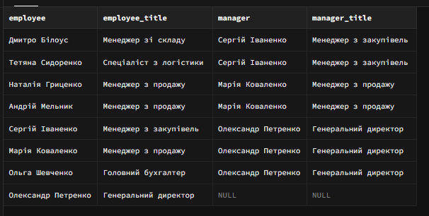

# Лабораторна робота 2. Створення складних SQL запитів

## Загальна інформація

**Здобувач освіти:** [Анікєєнко Микола Олескандрович]
**Група:** [ІПЗ-32]
**Обраний рівень складності:** [3]

## Виконання завдань

### Рівень 1

#### 1. З'єднання таблиць

**Завдання 1.1:** INNER JOIN - список товарів з категоріями та постачальниками

```sql
SELECT p.product_name, c.category_name, s.company_name, p.unit_price
FROM products p
INNER JOIN categories c ON p.category_id = c.category_id
INNER JOIN suppliers s ON p.supplier_id = s.supplier_id
ORDER BY c.category_name, p.product_name;

```

**Результат виконання:**
Результат 

**Пояснення:** Опишіть, що робить цей запит та які таблиці з'єднуються.


**Завдання 1.2:** LEFT JOIN - клієнти з кількістю замовлень

```sql
SELECT c.contact_name, c.customer_type, r.region_name,
      COUNT(o.order_id) as order_count
FROM customers c
LEFT JOIN orders o ON c.customer_id = o.customer_id
LEFT JOIN regions r ON c.region_id = r.region_id
GROUP BY c.customer_id, c.contact_name, c.customer_type, r.region_name
ORDER BY order_count DESC;

```

**Результат виконання:**


**Пояснення:** Поясніть різницю між INNER JOIN та LEFT JOIN на цьому прикладі.


**Завдання 1.3:** Множинне з'єднання - детальна інформація про замовлення

```sql
SELECT
    r.region_name AS "Регіон Доставки",
    p.product_name AS "Назва Товару",
    SUM(oi.quantity) AS "Загальна Кількість (шт.)",
    ROUND(SUM(oi.unit_price * oi.quantity * (1 - oi.discount)), 2) AS "Загальний Дохід"
FROM regions r
JOIN orders o ON r.region_id = o.ship_region_id  -- 1. З'єднання Регіонів з Замовленнями
JOIN order_items oi ON o.order_id = oi.order_id  -- 2. З'єднання Замовлень з Деталями Замовлень
JOIN products p ON oi.product_id = p.product_id  -- 3. З'єднання Деталей Замовлень з Товарами
WHERE o.order_status = 'delivered' -- Враховуємо лише виконані замовлення
GROUP BY r.region_name, p.product_name
ORDER BY "Регіон Доставки" ASC, "Загальний Дохід" DESC;

```

**Результат виконання:**


**Аналіз складності:** Оцініть складність запиту та поясніть послідовність з'єднань.


#### 2. Агрегатні функції

**Завдання 2.1:** Статистика товарів за категоріями

```sql
SELECT c.category_name,
      COUNT(p.product_id) as product_count,
      AVG(p.unit_price) as avg_price,
      MIN(p.unit_price) as min_price,
      MAX(p.unit_price) as max_price
FROM categories c
LEFT JOIN products p ON c.category_id = p.category_id
GROUP BY c.category_id, c.category_name
ORDER BY product_count DESC;

```

**Результат виконання:**


**Завдання 2.2:** Продажі за регіонами з використанням HAVING

```sql
SELECT
    r.region_name AS "Назва Регіону",
    -- Розрахунок загальної суми продажів (ціна * кількість * (1 - знижка))
    SUM(oi.unit_price * oi.quantity * (1 - oi.discount)) AS "Загальна Сума Продажів (грн)"
FROM
    regions r
JOIN
    customers c ON r.region_id = c.region_id
JOIN
    orders o ON c.customer_id = o.customer_id
JOIN
    order_items oi ON o.order_id = oi.order_id
WHERE
    -- Включаємо лише завершені замовлення для розрахунку реальної виручки
    o.order_status = 'delivered'
GROUP BY
    r.region_name
HAVING
    -- Фільтруємо групи, залишаючи лише ті регіони, де мінимум 1 покупка
    SUM(oi.unit_price * oi.quantity * (1 - oi.discount)) > 1.00
ORDER BY
    "Загальна Сума Продажів (грн)" DESC;
```

**Результат виконання:**


**Завдання 2.3:** Постачальники з кількістю товарів більше 2

```sql
SELECT
    s.company_name AS "Назва Постачальника",
    COUNT(p.product_id) AS "Кількість Товарів"
FROM
    suppliers s
JOIN
    products p ON s.supplier_id = p.supplier_id
GROUP BY
    s.company_name
HAVING
    COUNT(p.product_id) > 2
ORDER BY
    "Кількість Товарів" DESC;

```

**Результат виконання:**


#### 3. Базові підзапити

**Завдання 3.1:** Товари з ціною вище середньої по категорії

```sql
SELECT p.product_name, p.unit_price, c.category_name
FROM products p
INNER JOIN categories c ON p.category_id = c.category_id
WHERE p.unit_price > (
    SELECT AVG(p2.unit_price)
    FROM products p2
    WHERE p2.category_id = p.category_id
)
ORDER BY c.category_name, p.unit_price DESC;
```

**Результат виконання:**


**Завдання 3.2:** Клієнти з замовленнями у 2024 році

```sql
SELECT
    c.customer_id AS "ID Клієнта",
    c.contact_name AS "Контактна Особа",
    c.company_name AS "Компанія",
    c.email AS "Email"
FROM
    customers c
WHERE
    c.customer_id IN (
        SELECT DISTINCT
            o.customer_id
        FROM
            orders o
        WHERE
            -- Фільтруємо замовлення за 2024 роком
            EXTRACT(YEAR FROM o.order_date) = 2024
    )
ORDER BY
    c.customer_id;

```

**Результат виконання:**


**Завдання 3.3:** Товари з загальною кількістю продажів

```sql
SELECT
    p.product_id AS "ID Товару",
    p.product_name AS "Назва Товару",
    c.category_name AS "Категорія",
    p.unit_price AS "Ціна (грн)",
    p.units_in_stock AS "На Складі",
    -- Скалярний підзапит для обчислення загальної кількості проданих одиниць
    (
        SELECT
            COALESCE(SUM(oi.quantity), 0)
        FROM
            order_items oi
        JOIN
            orders o ON oi.order_id = o.order_id
        WHERE
            oi.product_id = p.product_id  -- Зв'язування з зовнішнім запитом
            AND o.order_status = 'delivered' -- Враховуємо лише доставлені замовлення
    ) AS "Загальна Кількість Проданих"
FROM
    products p
JOIN
    categories c ON p.category_id = c.category_id
ORDER BY
    "Загальна Кількість Проданих" DESC, p.product_name;
```

**Результат виконання:**


### Рівень 2

#### 4. Складні з'єднання

**Завдання 4.1:** RIGHT JOIN - аналіз категорій та товарів

```sql
SELECT c.category_name,
      COUNT(p.product_id) as products_count,
      COALESCE(AVG(p.unit_price), 0) as avg_price
FROM products p
RIGHT JOIN categories c ON p.category_id = c.category_id
GROUP BY c.category_id, c.category_name
ORDER BY products_count DESC;
```

**Результат виконання:**


**Завдання 4.2:** Self-join - співробітники та керівники

```sql
SELECT e1.first_name || ' ' || e1.last_name as employee,
      e1.title as employee_title,
      e2.first_name || ' ' || e2.last_name as manager,
      e2.title as manager_title
FROM employees e1
LEFT JOIN employees e2 ON e1.reports_to = e2.employee_id
ORDER BY e2.last_name, e1.last_name;
```

**Результат виконання:**


#### 5. Віконні функції

**Завдання 5.1:** Ранжування товарів за ціною в категоріях

```sql
SELECT p.product_name,
      c.category_name,
      p.unit_price,
      RANK() OVER (PARTITION BY c.category_name ORDER BY p.unit_price DESC) as price_rank,
      DENSE_RANK() OVER (PARTITION BY c.category_name ORDER BY p.unit_price DESC) as price_dense_rank,
      ROW_NUMBER() OVER (PARTITION BY c.category_name ORDER BY p.unit_price DESC) as row_num
FROM products p
JOIN categories c ON p.category_id = c.category_id
ORDER BY c.category_name, p.unit_price DESC;

```

**Результат виконання:**


**Завдання 5.2:** Порівняння замовлень з попередніми датами

```sql
SELECT
    o.order_id AS "ID Замовлення",
    c.contact_name AS "Клієнт",
    o.order_date AS "Поточна Дата Замовлення",
    -- Визначення дати попереднього замовлення
    LAG(o.order_date, 1) OVER (
        PARTITION BY c.customer_id
        ORDER BY o.order_date
    ) AS "Дата Попереднього Замовлення",
    -- Визначення дати наступного замовлення
    LEAD(o.order_date, 1) OVER (
        PARTITION BY c.customer_id
        ORDER BY o.order_date
    ) AS "Дата Наступного Замовлення"
FROM
    orders o
JOIN
    customers c ON o.customer_id = c.customer_id
ORDER BY
    c.contact_name,
    o.order_date;
```

**Результат виконання:**


### Рівень 3

#### 6. Матеріалізовані представлення та рекурсивні запити

**Завдання 6.1:** Матеріалізоване представлення для аналізу продажів

```sql
CREATE MATERIALIZED VIEW mv_monthly_sales AS
SELECT
    EXTRACT(YEAR FROM o.order_date) as year,
    EXTRACT(MONTH FROM o.order_date) as month,
    c.category_name,
    r.region_name,
    SUM(oi.quantity * oi.unit_price * (1 - oi.discount)) as total_revenue,
    COUNT(DISTINCT o.order_id) as orders_count,
    AVG(oi.quantity * oi.unit_price * (1 - oi.discount)) as avg_order_value
FROM orders o
JOIN order_items oi ON o.order_id = oi.order_id
JOIN products p ON oi.product_id = p.product_id
JOIN categories c ON p.category_id = c.category_id
JOIN customers cu ON o.customer_id = cu.customer_id
LEFT JOIN regions r ON cu.region_id = r.region_id
WHERE o.order_status = 'delivered'
GROUP BY year, month, c.category_name, r.region_name;

-- Створення індексу для матеріалізованого представлення
CREATE INDEX idx_mv_monthly_sales_date ON mv_monthly_sales(year, month);
```

**Пояснення:** Поясніть переваги використання матеріалізованих представлень.
### Матеріалізовані представлення є ідеальним вибором, коли швидкість читання має критичне значення, а дані не обов'язково повинні бути актуальними до останньої секунди

**Завдання 6.2:** Рекурсивний запит для ієрархії співробітників

```sql
WITH RECURSIVE employee_hierarchy AS (
    -- Базовий випадок: топ-менеджери (без керівника)
    SELECT employee_id, first_name, last_name, title, reports_to,
          0 as level,
          CAST(last_name || ' ' || first_name as VARCHAR(1000)) as hierarchy_path
    FROM employees
    WHERE reports_to IS NULL

    UNION ALL

    -- Рекурсивний випадок: підлеглі
    SELECT e.employee_id, e.first_name, e.last_name, e.title, e.reports_to,
          eh.level + 1,
          CAST(eh.hierarchy_path || ' -> ' || e.last_name || ' ' || e.first_name as VARCHAR(1000))
    FROM employees e
    JOIN employee_hierarchy eh ON e.reports_to = eh.employee_id
)
SELECT * FROM employee_hierarchy
ORDER BY hierarchy_path;

```

**Результат виконання:**


## Аналіз продуктивності

### Дослідження планів виконання

**Найповільніший запит:**
```sql
EXPLAIN ANALYZE
SELECT
    r.region_name,
    SUM(oi.unit_price * oi.quantity * (1 - oi.discount))
FROM regions r
JOIN customers c ON r.region_id = c.region_id
JOIN orders o ON c.customer_id = o.customer_id
JOIN order_items oi ON o.order_id = oi.order_id
WHERE o.order_status = 'delivered'
GROUP BY r.region_name
HAVING SUM(oi.unit_price * oi.quantity * (1 - oi.discount)) > 500000.00;
```

**План виконання (EXPLAIN ANALYZE):**


**Запропоновані оптимізації:**
1. Створення Матеріалізованого Представлення [Цей звіт є аналітичним. Попереднє обчислення всіх агрегацій, JOIN'ів та фільтрації (o.order_status = 'delivered') у представленні перетворить складний запит на просте зчитування з однієї таблиці, знижуючи час виконання з секунд до мілісекунд.]
2. Оптимізація Індексів [Дозволить PostgreSQL швидко знаходити потрібні замовлення, використовуючи індекс, а не Seq Scan.]

### Створені індекси

**Індекс 1:**
```sql
CREATE INDEX idx_orders_status_customer_id ON orders(order_status, customer_id);

```
**Обґрунтування:** [Фільтрація (order_status): Вказуючи order_status першим у індексі, ми дозволяємо СУБД миттєво відкинути всі замовлення, які не мають статусу 'delivered'.]

**Індекс 2:**
```sql
CREATE INDEX idx_customers_region ON customers(region_id);
```
**Обґрунтування:** [Оптимізує будь-які запити, що групують або фільтрують клієнтів за регіонами (наприклад, для звіту про клієнтську базу по областях).]


## Порівняльний аналіз

### Ефективність різних підходів

**Завдання:** Знайти топ-5 найдорожчих товарів у кожній категорії

**Підхід 1: Віконні функції**
```sql
SELECT
    "Назва Товару",
    "Категорія",
    "Ціна (грн)"
FROM (
    SELECT
        p.product_name AS "Назва Товару",
        c.category_name AS "Категорія",
        p.unit_price AS "Ціна (грн)",
        -- Віконна функція ранжування
        ROW_NUMBER() OVER (
            PARTITION BY p.category_id -- Розділити дані за категорією
            ORDER BY p.unit_price DESC  -- Сортувати за ціною (від найдорожчого)
        ) AS rn -- Призначити унікальний номер рядка (ранг) у межах кожної категорії
    FROM
        products p
    JOIN
        categories c ON p.category_id = c.category_id
) AS ranked_products
WHERE
    rn <= 5 -- Вибрати лише ті, що отримали ранг від 1 до 5
ORDER BY
    "Категорія", "Ціна (грн)" DESC;
```

**Підхід 2: Корельований підзапит**
```sql
SELECT
    p.product_name AS "Назва Товару",
    c.category_name AS "Категорія",
    p.unit_price AS "Ціна (грн)"
FROM
    products p
JOIN
    categories c ON p.category_id = c.category_id
WHERE
    (
        SELECT
            COUNT(p2.product_id)
        FROM
            products p2
        WHERE
            p2.category_id = p.category_id -- Кореляція: у тій же категорії
            AND p2.unit_price > p.unit_price -- Товари, дорожчі за поточний товар
    ) < 5 -- Якщо дорожчих товарів менше 5, то цей товар входить у топ-5
ORDER BY
    "Категорія", "Ціна (грн)" DESC;
```

**Час виконання:**
- Віконні функції: [нижчий]
- Корельований підзапит: [вищий]

**Висновок:** [У переважній більшості випадків, особливо на великих базах даних, Підхід 1 з віконними функціями (ROW_NUMBER()) є значно ефективнішим. PostgreSQL може оптимізувати операцію PARTITION BY... ORDER BY набагато краще, ніж багаторазове виконання корельованого підзапиту. Використання корельованого підзапиту (Підхід 2) для цієї задачі є класичним прикладом неоптимального SQL-коду.]


## Висновки

**Самооцінка**: [4]

**Обгрунтування**: [Зроблоне все, здано з запізненям] 
